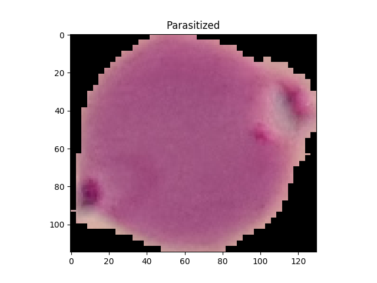
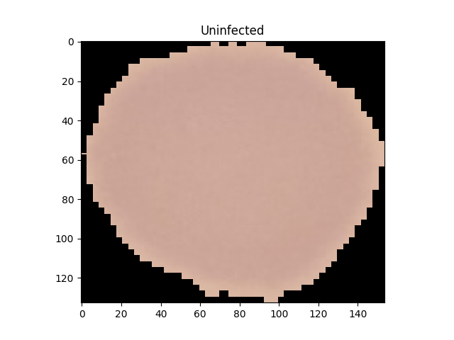

# Malaria-Cell-Detection_Image_Classifier
This Image Classifier is used to detect Malaria Cells in a Human.The test accuracy of this model is ***96.2 %*** .

## How to use
- ***Train*** directory contains the training dataset images.
- ***Saved_Model*** will contain the already trained Classifier model.The test accuracy of this model is ***96.2 %*** .
- ***CNN.py*** is the script to design the Conv-net.

## Modules Used
- Keras
- random
- numpy
- os
- opencv

## Description
The Dataset is obtained from Kaggle. [Click Here](https://www.kaggle.com/iarunava/cell-images-for-detecting-malaria/home) for more information.

## Cell Images

### Parasitized

### Uninfected

## Author
- Jiten Sinha - [LinkedIn](https://www.linkedin.com/in/jiten-sinha-131043159/)

## License
Read [License](https://github.com/jitensinha98/Malaria-Cell-Detection_Image_Classifier/blob/master/LICENSE) for more information.
